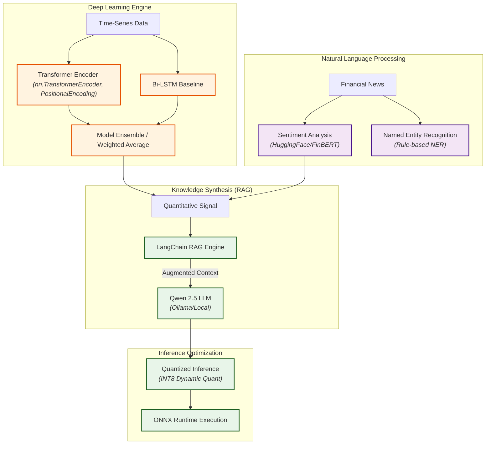
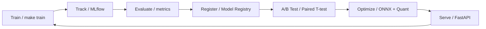
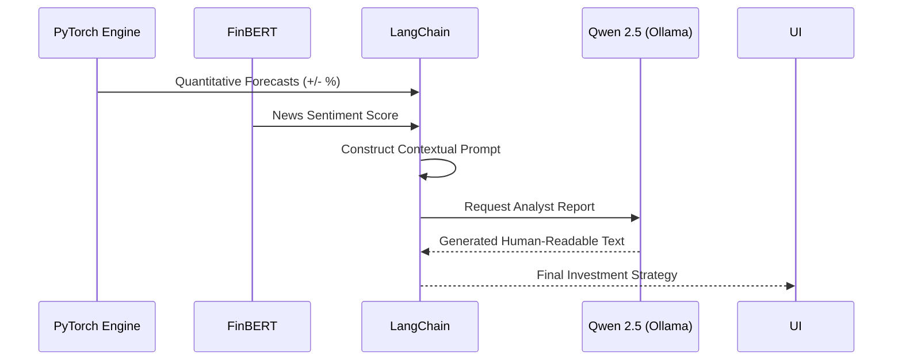

# StockSense AI

Welcome to StockSense AI. I built this project to tackle a common problem in quantitative finance: the disconnect between raw price action and unstructured market sentiment. Instead of relying solely on traditional time-series models or basic sentiment scores, I wanted to engineer a system that genuinely synthesizes both, much like a human analyst would, but at scale.

This repository serves as a blueprint for a production-grade **Intelligence Lifecycle**. My focus here was on architectural rigor—designing custom PyTorch Transformer encoders for volatile OHLCV data, integrating a robust NLP pipeline using FinBERT for sentiment and NER, and tying it all together with an agentic RAG layer using local LLMs (Qwen 2.5) via LangChain. 

Beyond just getting good predictions, I spent a lot of time on inference engineering. By applying post-training dynamic quantization (INT8) and exporting to ONNX Runtime, the system is optimized for sub-millisecond latency, making it ready for real-time edge serving.

## 🧠 Core Intelligence Architecture



## ⚙️ Technical Highlights

- **Deep Learning Engine:** I implemented a custom PyTorch Transformer Encoder with Multi-Head Self-Attention and Sinusoidal Positional Encodings. Time-series financial data is incredibly noisy, and this architecture helps capture long-term dependencies much better than standard RNNs.
- **Financial NLP Pipeline:** To give the model context, I integrated **FinBERT** (ProsusAI) for domain-specific sentiment analysis and built a rule-based Named Entity Recognition (NER) pipeline. This aligns real-world news triggers directly with our quantitative signals.
- **Agentic RAG Synthesis:** Instead of just outputting numbers, I built an intelligent layer using **LangChain**. It synthesizes the numerical forecasts and unstructured news data, feeding it as augmented context into a local **Qwen 2.5 (7B-Instruct)** model to generate professional, readable investment reports.
- **Inference Engineering:** PyTorch models can be heavy. To make this API production-ready, I applied **Post-Training Dynamic Quantization (INT8)** and converted the execution graphs to **ONNX Runtime**. This drastically reduced latency and memory footprint.
- **MLOps & Validation:** Model performance is statistically validated using Paired T-Tests (p-value < 0.05). I also integrated **MLflow** to track experiments, hyperparameters, and model registries systematically.

### 📊 Model Comparison

| Feature | Transformer Encoder (Custom) | Bidirectional LSTM |
| :--- | :--- | :--- |
| **Architecture** | Attention-based Parallel Processing | Recurrent Sequential Memory |
| **Temporal Range** | Context-aware Global Dependencies | Limited by Vanishing Gradients |
| **Normalization** | Pre-Normalization (Stable-Transformer) | Standard Batch/Layer Norm |
| **Speed** | High (Parallelizable) | Moderate (Sequential) |
| **Interpretability** | Attention Maps (XAI) | Hidden State Visualization |

## 🧬 MLOps Lifecycle



## 🏗 System Flow

1. **Extraction:** Gathering market data via `yfinance` and parsing RSS feeds for breaking financial news.
2. **Preprocessing:** Engineering features like RSI, MACD, and Bollinger Bands, alongside robust standard scaling.
3. **Core Forecasting:** Running our ensemble of PyTorch models to generate baseline predictions.
4. **Optimization:** Quantizing the models and porting them to ONNX for lightning-fast inference.
5. **Serving Layer:** Exposing the intelligence through a highly concurrent Uvicorn/FastAPI instance.
6. **Logging:** Keeping everything reproducible and tracked via MLflow.

### 🤖 RAG Pipeline Architecture



## 🛠 Setup & Installation

**Prerequisites:** Python 3.10+ is highly recommended. Please use a virtual environment.

```bash
# Clone the repository
git clone https://github.com/saciducak/stocksense-ai.git
cd stocksense-ai

# Set up the Python environment
python -m venv venv
source venv/bin/activate

# Install requirements
make install
```

## 🚀 Quick Start Commands

I've provided a `Makefile` to abstract away the boilerplate and make running the pipeline straightforward.

**Training & Experiments:**
```bash
make train                        # Train the Custom Transformer
make train-lstm                   # Train the LSTM baseline
make train MODEL=all              # Train all models concurrently
```

**Optimization Pipeline:**
*(Note: I've included workarounds in the optimization script to handle PyTorch ONNX exporter bugs related to MultiheadAttention batch sizes.)*
```bash
make optimize                     # Runs Quantization, ONNX Export, and Benchmarks
```

**Serving:**
```bash
make serve                        # Spin up the FastAPI prediction server
make mlflow-ui                    # Track runs via MLFlow Local Tracking Server
```

## 📁 Project Structure

```
stocksense-ai/
├── configs/               # Centralized configuration (YAML)
├── src/
│   ├── data/              # Feature engineering, scalers, and data hooks
│   ├── models/            # PyTorch Lightning-ready models (LSTM, Transformer)
│   ├── nlp/               # Hugging Face Transformers wrapping
│   ├── optimization/      # Quantization logics, ONNX wrappers, benchmarking
│   ├── mlops/             # MLflow, A/B testing implementations
│   └── api/               # API routes, Pydantic V2 schemas, middleware
├── scripts/               # Entry points (train.py, optimize.py, evaluate.py)
├── Makefile               # Task runner definitions
└── pyproject.toml         # Packaging bounds
```

## 🔮 Future Work & Extensions
- Transitioning the ONNX baseline into TensorRT clusters to measure intra-GPU sub-batch latencies.
- Implementing Distributed Data Parallel (DDP) for large-scale Transformer training to handle tick-level data.

## License
MIT License.
