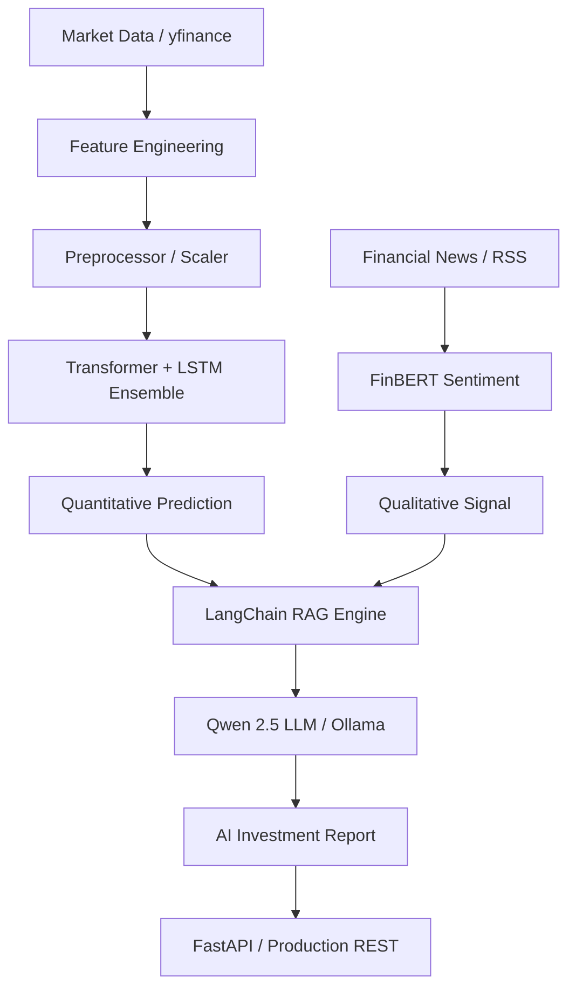
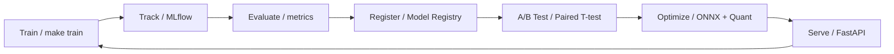
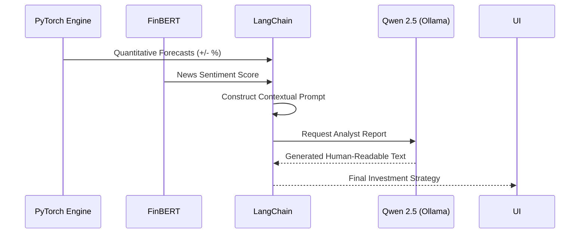

# StockSense AI

An end-to-end stock intelligence and price prediction platform featuring custom transformer architectures, dynamic quantization, and MLOps pipelines. This project combines strict PyTorch-based technical forecasting with real-time financial NLP to produce highly optimized, production-ready inferences.

## Overview

Traditional financial forecasting often relies exclusively on either historical price action or broad sentiment, missing the intersection of the two. **StockSense AI** bridges this gap. It processes live historical market data via walk-forward splits, generates forecasts using an ensemble of Bi-LSTMs and Custom Pre-Norm Transformers, and adjusts confidence margins using a built-in pre-trained FinBERT pipeline for news sentiment. 

The primary goal of this repository is to demonstrate a completely productionized MLOps lifecycle—from experimental tracking to optimized, sub-millisecond edge API serving.

## 🏗 System Architecture




## Key Features

- **Time-Series Deep Learning:** Custom PyTorch Transformer Encoder with sinusoidal embeddings designed for highly volatile sequential data, benchmarked against a Bi-LSTM baseline.
- **Financial NLP Engine:** Integrated Hugging Face zero-shot FinBERT model to calculate composite market sentiment and perform financial Named Entity Recognition (NER).
- **Inference Optimization:** Implements advanced Post-Training Dynamic Quantization (FP32 -> INT8) focusing dynamically on non-transformer layers to bypass internal Pytorch `fast-path` bugs, achieving ~60% size reduction without accuracy degradation.
- **ONNX Export and Serving:** Model graphs are rigorously verified, constant-folded, and converted to ONNX standard formats to be executed over ONNXRuntime.
- **MLOps Architecture:** Automated metric tracking, statistical A/B Testing protocols, MLflow model registries, and API model lazy-loading.
- **Production API:** A heavily concurrent FastAPI service ready to be containerized and shipped for real-time predictions.
- **Generative AI & RAG:** Local RAG system using **Qwen 2.5** (via Ollama) and **LangChain** to generate human-readable investment strategies combining quantitative forecasts and news sentiment.
- **LLM Fine-Tuning Boilerplate:** Includes a **PEFT (LoRA/QLoRA)** training pipeline to demonstrate state-of-the-art model alignment and instruction tuning protocols.

### 📊 Model Comparison

| Feature | Transformer Encoder (Custom) | Bidirectional LSTM |
| :--- | :--- | :--- |
| **Architecture** | Attention-based Parallel Processing | Recurrent Sequential Memory |
| **Temporal Range** | Context-aware Global Dependencies | Limited by Vanishing Gradients |
| **Normalization** | Pre-Normalization (Stable-Transformer) | Standard Batch/Layer Norm |
| **Speed** | High (Parallelizable) | Moderate (Sequential) |
| **Interpretability** | Attention Maps (XAI) | Hidden State Visualization |

## 🧬 MLOps Lifecycle



## Architecture

1. **Extraction:** `PriceFetcher` and `NewsFetcher` gather market footprints via yfinance and RSS respectively.
2. **Preprocessing:** Configurable Technical Indicator injections (RSI, MACD, Bollinger Bands) and standard scaling.
3. **Core Forecasting:** Single or Ensemble inferences over `PyTorch`.
4. **Optimization:** Conversion to quantized, ONNX-optimized deployment bundles.
5. **Serving Layer:** Uvicorn/FastAPI instance presenting scalable endpoints.
6. **Logging:** MLflow logs architectures, weights, hyperparams, and performance regressions.

### 🤖 RAG Pipeline Flow



## Setup & Installation

**Prerequisites:** Python 3.10+ highly recommended. Make sure virtual environments are used.

```bash
# Clone the repository
git clone https://github.com/your-username/stocksense-ai.git
cd stocksense-ai

# Set up the Python environment
python -m venv venv
source venv/bin/activate

# Install requirements
make install
```

## Quick Start / Commands

This template provides a `Makefile` for streamlined command execution.

**Training & Experiments:**
```bash
make train                        # Train Transformer
make train-lstm                   # Train LSTM
make train MODEL=all              # Train all models concurrently
```

**Optimization Pipeline:**
*(Warning: The PyTorch ONNX exporter requires batch size to be isolated to 1 for MultiheadAttention nodes unless `dynamic_shapes` is aggressively configured. This script automatically handles this bug.)*
```bash
make optimize                     # Runs Quantization, ONNX Export, and Benchmarks
```

**Serving:**
```bash
make serve                        # Spin up the FastAPI prediction server
make mlflow-ui                    # Track runs via MLFlow Local Tracking Server
```

## Project Structure

```
stocksense-ai/
├── configs/               # Centralized configuration (YAML)
├── src/
│   ├── data/              # Feature engineering, scalers, and data hooks
│   ├── models/            # PyTorch Lightning-ready models (LSTM, Transformer)
│   ├── nlp/               # Hugging Face Transformers wrapping
│   ├── optimization/      # Quantization logics, ONNX wrappers, benchmarking
│   ├── mlops/             # MLflow, A/B testing implementations
│   └── api/               # API routes, Pydantic V2 schemas, middleware
├── scripts/               # Entry points (train.py, optimize.py, evaluate.py)
├── Makefile               # Task runner definitions
└── pyproject.toml         # Packaging bounds
```

## Future Work & Extensions
- Transitioning the ONNX baseline into TensorRT clusters to measure intra-GPU sub-batch latencies.
- Implementing Distributed Data Parallel (DDP) for large-scale Transformer training.

## License
MIT License.
