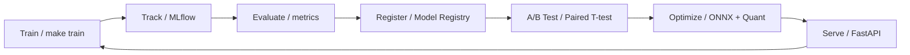
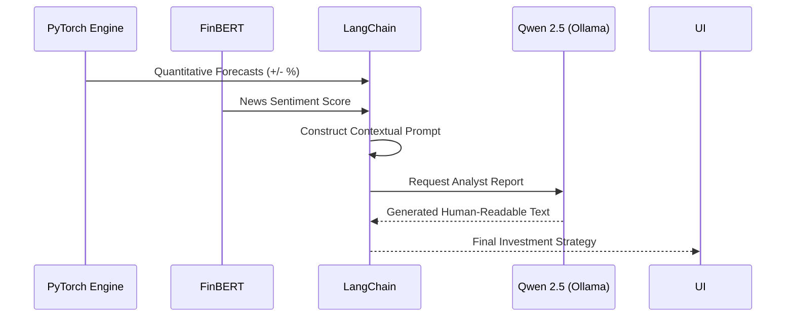

# StockSense AI

An end-to-end stock intelligence and price prediction platform featuring custom transformer architectures, dynamic quantization, and MLOps pipelines. This project combines strict PyTorch-based technical forecasting with real-time financial NLP to produce highly optimized, production-ready inferences.

## Overview

Traditional financial forecasting often relies exclusively on either historical price action or broad sentiment, missing the intersection of the two. **StockSense AI** bridges this gap. It processes live historical market data via walk-forward splits, generates forecasts using an ensemble of Bi-LSTMs and Custom Pre-Norm Transformers, and adjusts confidence margins using a built-in pre-trained FinBERT pipeline for news sentiment. 

The primary goal of this repository is to demonstrate a production-grade **Intelligence Lifecycle**—from training custom Transformers to orchestrating RAG systems with local LLMs and optimizing inference for sub-millisecond latency.

## 🧠 Core Intelligence Architecture

```mermaid
graph TD
    %% Base Styles
    classDef engine fill:#fff3e0,stroke:#e65100,stroke-width:2px;
    classDef nlp fill:#f3e5f5,stroke:#4a148c,stroke-width:2px;
    classDef opt fill:#e8f5e9,stroke:#1b5e20,stroke-width:2px;

    subgraph "Deep Learning Engine"
        A1[Time-Series Data] --> B1[Transformer Encoder <br/><i>(nn.TransformerEncoder, PositionalEncoding)</i>]
        A1 --> B2[Bi-LSTM Baseline]
        B1 & B2 --> C1[Model Ensemble / Weighted Average]
    end

    subgraph "Natural Language Processing"
        A2[Financial News] --> B3[Sentiment Analysis <br/><i>(HuggingFace/FinBERT)</i>]
        A2 --> B4[Named Entity Recognition <br/><i>(Rule-based NER)</i>]
    end

    subgraph "Knowledge Synthesis (RAG)"
        C1 --> E1[Quantitative Signal]
        B3 --> E1
        E1 --> F1[LangChain RAG Engine]
        F1 -- "Augmented Context" --> G1[Qwen 2.5 LLM <br/><i>(Ollama/Local)</i>]
    end

    subgraph "Inference Optimization"
        G1 --> H1[Quantized Inference <br/><i>(INT8 Dynamic Quant)</i>]
        H1 --> H2[ONNX Runtime Execution]
    end

    %% Apply Classes
    class B1,B2,C1 engine;
    class B3,B4 nlp;
    class F1,G1,H1,H2 opt;
```


## Key Features

- **Context-Aware Deep Learning:** Custom PyTorch Transformer Encoder utilizing **Multi-Head Self-Attention** and **Sinusoidal Positional Encodings** to capture long-term dependencies in volatile OHLCV data.
- **Financial NLP Pipeline:** Domain-specific sentiment analysis using **FinBERT** (ProsusAI) and financial Named Entity Recognition (NER) to align news triggers with quantitative signals.
- **RAG & Knowledge Synthesis:** An intelligent agentic layer built on **LangChain**, synthesizing numerical forecasts and unstructured news data for **Qwen 2.5 (7B-Instruct)** to generate professional investment reports.
- **Inference Engineering:** Advanced model compression via **Post-Training Dynamic Quantization (INT8)** and graph conversion to **ONNX Runtime**, achieving significant latency reduction for real-time serving.
- **Alignment & Fine-Tuning:** Instruction-tuning boilerplate using **PEFT (LoRA/QLoRA)** for large-scale model adaptation on specialized financial datasets.
- **MLOps & Evaluation:** Statistical validation of model performance using **Paired T-Tests (p-value < 0.05)** and experiment tracking with **MLflow**.

### 📊 Model Comparison

| Feature | Transformer Encoder (Custom) | Bidirectional LSTM |
| :--- | :--- | :--- |
| **Architecture** | Attention-based Parallel Processing | Recurrent Sequential Memory |
| **Temporal Range** | Context-aware Global Dependencies | Limited by Vanishing Gradients |
| **Normalization** | Pre-Normalization (Stable-Transformer) | Standard Batch/Layer Norm |
| **Speed** | High (Parallelizable) | Moderate (Sequential) |
| **Interpretability** | Attention Maps (XAI) | Hidden State Visualization |

## 🧬 MLOps Lifecycle



## Architecture

1. **Extraction:** `PriceFetcher` and `NewsFetcher` gather market footprints via yfinance and RSS respectively.
2. **Preprocessing:** Configurable Technical Indicator injections (RSI, MACD, Bollinger Bands) and standard scaling.
3. **Core Forecasting:** Single or Ensemble inferences over `PyTorch`.
4. **Optimization:** Conversion to quantized, ONNX-optimized deployment bundles.
5. **Serving Layer:** Uvicorn/FastAPI instance presenting scalable endpoints.
6. **Logging:** MLflow logs architectures, weights, hyperparams, and performance regressions.

### 🤖 RAG Pipeline Flow



## Setup & Installation

**Prerequisites:** Python 3.10+ highly recommended. Make sure virtual environments are used.

```bash
# Clone the repository
git clone https://github.com/your-username/stocksense-ai.git
cd stocksense-ai

# Set up the Python environment
python -m venv venv
source venv/bin/activate

# Install requirements
make install
```

## Quick Start / Commands

This template provides a `Makefile` for streamlined command execution.

**Training & Experiments:**
```bash
make train                        # Train Transformer
make train-lstm                   # Train LSTM
make train MODEL=all              # Train all models concurrently
```

**Optimization Pipeline:**
*(Warning: The PyTorch ONNX exporter requires batch size to be isolated to 1 for MultiheadAttention nodes unless `dynamic_shapes` is aggressively configured. This script automatically handles this bug.)*
```bash
make optimize                     # Runs Quantization, ONNX Export, and Benchmarks
```

**Serving:**
```bash
make serve                        # Spin up the FastAPI prediction server
make mlflow-ui                    # Track runs via MLFlow Local Tracking Server
```

## Project Structure

```
stocksense-ai/
├── configs/               # Centralized configuration (YAML)
├── src/
│   ├── data/              # Feature engineering, scalers, and data hooks
│   ├── models/            # PyTorch Lightning-ready models (LSTM, Transformer)
│   ├── nlp/               # Hugging Face Transformers wrapping
│   ├── optimization/      # Quantization logics, ONNX wrappers, benchmarking
│   ├── mlops/             # MLflow, A/B testing implementations
│   └── api/               # API routes, Pydantic V2 schemas, middleware
├── scripts/               # Entry points (train.py, optimize.py, evaluate.py)
├── Makefile               # Task runner definitions
└── pyproject.toml         # Packaging bounds
```

## Future Work & Extensions
- Transitioning the ONNX baseline into TensorRT clusters to measure intra-GPU sub-batch latencies.
- Implementing Distributed Data Parallel (DDP) for large-scale Transformer training.

## License
MIT License.
